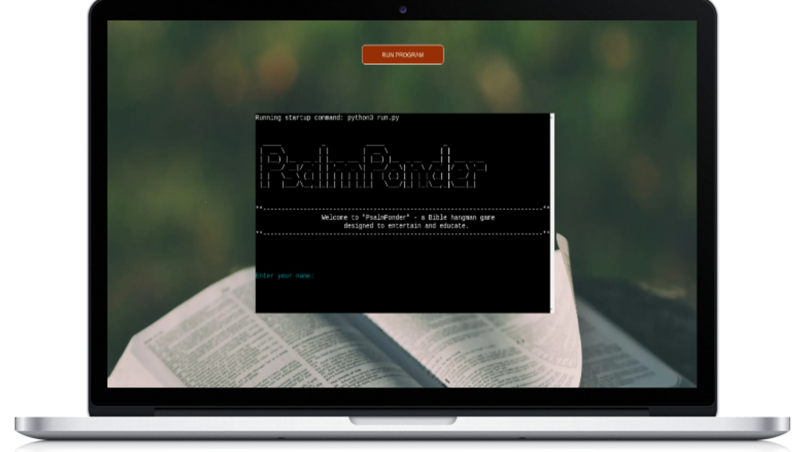

<h1 align="center">PsalmPonder - Bible Hangman Game</h1>

### Developer: Samarpan Raj

<b>[View live program here](https://psalm-ponder-3ea323cf5eda.herokuapp.com/)</b> :computer:

The PsalmPonder App was created as Portfolio Project #3 (Python Essentials) for Diploma in Full Stack Software Development at [Code Institute](https://www.codeinstitute.net). 

PsalmPonder is a command-line based Bible hangman game designed to entertain and educate users by challenging their knowledge of Psalms from the Bible. Players can guess letters to complete a hidden word from Psalms and have fun while learning more about this biblical book.

## How to Play
- Run the program and start Hangman game.
- Enter your name when prompted after the welcome message.
  - Choose an option:
    - 1: Start the game.
    - 2: Read instructions.
    - 3: Exit the game.
- Objective: Guess the hidden word before running out of lives.
### Rules:
- You have 7 lives.
- For each incorrect guess, lose a life.
- Guess the word correctly to win.
### Gameplay:
- Guess a single letter.
- Correct guesses reveal the letter's position.
- Incorrect guesses deduct a life.
- Visual hangman representation appears for incorrect guesses.
- Win by correctly guessing all letters.
### End of Game:
- If lives run out, the game ends.
- Correct word is revealed.
### Restart or Exit:
- Choose to restart the game after winning or losing.
- hoose the exit option to end the game.

##  Strategy/Scope

"PsalmPonder" is a fictional name created for a Bible-themed Hangman game. The name is a combination of "Psalm," referring to the Book of Psalms in the Bible, and "Ponder," suggesting reflection or contemplation. The idea behind the name is to convey the notion of thoughtful engagement with words related to Psalms through a word-guessing game.

In the context of the game, players are encouraged to ponder and reflect on words associated with Psalms as they guess and unveil the hidden words. The combination of gaming elements with a biblical theme aims to provide an entertaining and educational experience for players interested in the Book of Psalms and related concepts.

PsalmPonder is developed as a command-line-based Bible hangman game with the goal of entertaining and educating users about the Psalms from the Bible. The primary focus is on creating an engaging and interactive experience that combines fun and learning.

To achieve the strategy goals I implemented following features:

- clean user interface for easy navigation and readability
- colours in terminal to give user feedback depends on his actions
- customised terminal display page for better visual experience

## Site owner goals

As the creator and owner of PsalmPonder, I aim to:

- Develop the game that is challenging and entertaining as well as helps with biblical knowledge.
- Design an easy-to-use and intuitive interface for seamless navigation.
- Ensure the application features a clean, attractive, and accessible design.
- Provide users with feedback for every input and action, enhancing the user experience.
- Define and validate acceptable user inputs for a controlled and user-friendly interaction.
- Strive for a bug-free application to ensure a smooth and enjoyable gaming and learning experience.

## User Stories

- ### As a user I want to:
- Be welcomed with an introduction when I start the Hangman game.
- Be able to enter my name to personalize the gaming experience.
- See clear instructions on how to navigate through the game options.
- Start a new game and experience the excitement of guessing a word.
- Receive feedback on my guesses, whether they are correct or incorrect.
- See the progress of the word as I make correct guesses.
- Know the number of attempts (lives) remaining after each incorrect guess.
- See a visual representation of the hangman as I make incorrect guesses.
- Know when I have won the game by correctly guessing the word.
- Know when the game is over due to running out of lives and see the correct word.
- See the option to restart the game after it ends, to try again.
- See the option to exit the game when I'm done playing.
- The game to be enjoyable and provide a challenging experience.

