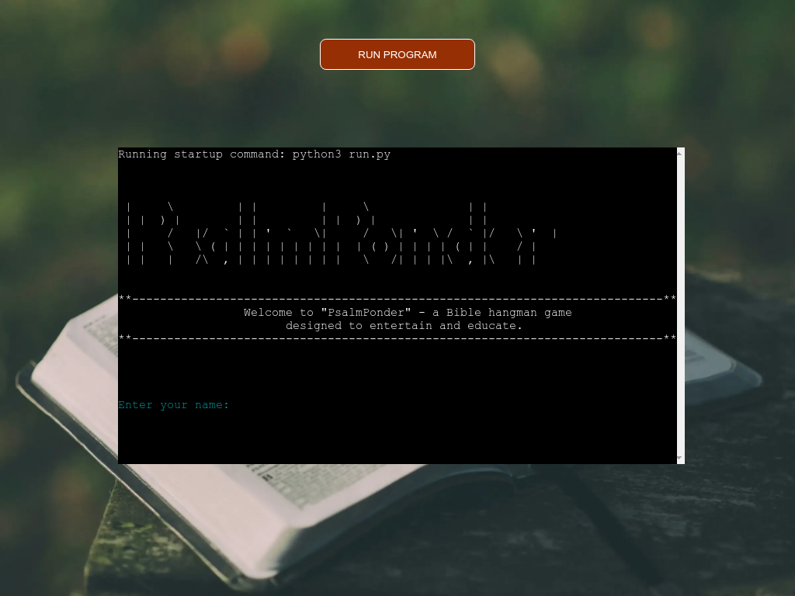
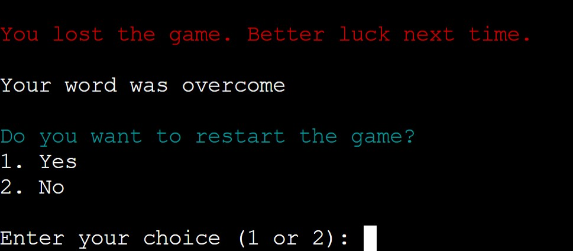

<h1 align="center">PsalmPonder - Bible Hangman Game</h1>

### Developer: Samarpan Raj

<b>[View live program here](https://psalm-ponder-3ea323cf5eda.herokuapp.com/)</b> :computer:

The PsalmPonder App was created as Portfolio Project #3 (Python Essentials) for Diploma in Full Stack Software Development at [Code Institute](https://www.codeinstitute.net). 

PsalmPonder is a command-line based Bible hangman game designed to entertain and educate users by challenging their knowledge of Psalms from the Bible. Players can guess letters to complete a hidden word from Psalms and have fun while learning more about this biblical book.

## How to Play
- Run the program and start Hangman game.
- Enter your name when prompted after the welcome message.
  - Choose an option:
    - 1: Start the game.
    - 2: Read instructions.
    - 3: Exit the game.
- Objective: Guess the hidden word before running out of lives.
### Rules:
- You have 7 lives.
- For each incorrect guess, lose a life.
- Guess the word correctly to win.
### Gameplay:
- Guess a single letter.
- Correct guesses reveal the letter's position.
- Incorrect guesses deduct a life.
- Visual hangman representation appears for incorrect guesses.
- Win by correctly guessing all letters.
### End of Game:
- If lives run out, the game ends.
- Correct word is revealed.
### Restart or Exit:
- Choose to restart the game after winning or losing.
- hoose the exit option to end the game.

##  Strategy/Scope

"PsalmPonder" is a fictional name created for a Bible-themed Hangman game. The name is a combination of "Psalm," referring to the Book of Psalms in the Bible, and "Ponder," suggesting reflection or contemplation. The idea behind the name is to convey the notion of thoughtful engagement with words related to Psalms through a word-guessing game.

In the context of the game, players are encouraged to ponder and reflect on words associated with Psalms as they guess and unveil the hidden words. The combination of gaming elements with a biblical theme aims to provide an entertaining and educational experience for players interested in the Book of Psalms and related concepts.

PsalmPonder is developed as a command-line-based Bible hangman game with the goal of entertaining and educating users about the Psalms from the Bible. The primary focus is on creating an engaging and interactive experience that combines fun and learning.

To achieve the strategy goals I implemented following features:

- clean user interface for easy navigation and readability
- colours in terminal to give user feedback depends on his actions
- customised terminal display page for better visual experience

## Site owner goals

As the creator and owner of PsalmPonder, I aim to:

- Develop the game that is challenging and entertaining as well as helps with biblical knowledge.
- Design an easy-to-use and intuitive interface for seamless navigation.
- Ensure the application features a clean, attractive, and accessible design.
- Provide users with feedback for every input and action, enhancing the user experience.
- Define and validate acceptable user inputs for a controlled and user-friendly interaction.
- Strive for a bug-free application to ensure a smooth and enjoyable gaming and learning experience.

## User Stories

- ### As a user I want to:
- Be welcomed with an introduction when I start the Hangman game.
- Be able to enter my name to personalize the gaming experience.
- See clear instructions on how to navigate through the game options.
- Start a new game and experience the excitement of guessing a word.
- Receive feedback on my guesses, whether they are correct or incorrect.
- See the progress of the word as I make correct guesses.
- Know the number of attempts (lives) remaining after each incorrect guess.
- See a visual representation of the hangman as I make incorrect guesses.
- Know when I have won the game by correctly guessing the word.
- Know when the game is over due to running out of lives and see the correct word.
- See the option to restart the game after it ends, to try again.
- See the option to exit the game when I'm done playing.
- The game to be enjoyable and provide a challenging experience.

#   User Experience (UX)
##  Colour Scheme

Colour palette was selected using <b>coolors.co</b> generator and has been extracted from the backgroud picture used in terminal view HTML page. Colour of the "run program" button was adjusted to pass the web accessibility score.

Terminal outputs are displayed in high-contrast colours over black background for better readability and accesibillity. Different colors used for different user inputs and game outputs. Emojis are used in the hangman display to improve the user experience.

Starting screen of the app:

# Logic and features

## Python Logic

A flow diagram of the logic behind the game was created using [Whimsical](https://whimsical.com/).

For PDF version [click here](docs/game-flow.pdf)

## Features

### Title and Introduction Section

Start screen of the application consists of ASCII logo which was created using patorjk.com, and the welcome message.
There is also a user name input field which has strong data validation. The user must enter a username consisting of letters only. They cannot just enter a blank space. If they do not enter valid data, an error message will appear in red saying "Invalid name. Please enter a valid name with only letters." 

### Options menu

The game offers a menu with options to start a new game, view instructions, and exit.
The user has to choose between 1 and 3, if user enter other than that they will see error message "Invalid choice"

### Instructions

Clear and concise instructions are provided for users to understand how to play the PsalmPonder Hangman game.

### Game Features

The user is shown with a word with blanks and the user has to guess the word. A clear message shows how many letters the word is which makes easy for the user to guess the word.
User has to enter only letters and if user enters any other characters or numbers they will see error message "Invalid input."

### Random Word Selection:

The game selects a random word from a predefined list for variety and unpredictability.

### Colorama Integration:

Colorama library is used to enhance the visual appeal of the game through colored text.

### Wrong guess

The user is shown with a word with blanks and the user has to guess the word. If the user guesses a wrong word he will see error message "Sorry, 'letter-entered' is not in the word. You lose a life.

### Attempts Left And Hangman Figure with Emoji

The user is shown number of attempts left for each guess as well as incorrect guesses are visually represented by a hangman figure through ASCII art with an emoji in it.

### Correct Guess

The user is shown with the message "Correct guess! 'letter-guessed' is in the word." and then the letter matches maximum number of times repeated in the word.

### Already Guessed

If the user tries to enter the already guessed correct letter again he will see a warning message "You already guessed all occurrences of the letter 'e'. Try a different one."

If the user tries to enter the already guessed incorrect letter again he will see a warning message "You already guessed the letter 's' and it was incorrect. Try a different one."

### Game Lost

If the user lost the game he will see the message "You lost the game. Better luck next time." along with the "Your word was actual-word"

### Game Restart

Users have the option to restart the game after completing a round. Users can choose to restart the game for another round or exit the game altogether.

## Testing

### PEP8 Testing
The python files have all been passed through [PEP8 Online](https://pep8ci.herokuapp.com/). All python files were checked with no errors reported. See screen show below:

  
run.py

  

  
wordlist.py

  

  
stages.py

  

  
hangmanintro.py

  

## Manual Testing
### User Name Input:

Entered my name when prompted.
Checked that the input validation allowed only alphabetic characters for the name.
Main Menu:

Selected option 1 to start the game.
Verified that the game setup occurred, and a word was selected from the word list.

### Game Display:

Checked that the game displayed the initial word with underscores representing each letter.
Verified that the correct number of blanks was shown.

### Letter Guessing:

Entered a single letter as instructed.
Ensured that the game handled invalid inputs appropriately and prompted for a valid single letter.

### Correct Guess:

Guessed a letter that was in the word.
Verified that the correct letter was revealed in the word and displayed as a correct guess.
Checked that the number of attempts and the hangman stages were updated accordingly.

### Incorrect Guess:

Guessed a letter that was not in the word.
Confirmed that a life was deducted, and the incorrect letter was displayed.
Checked that the number of attempts and the hangman stages were updated accordingly.

### Winning the Game:

Continued guessing letters until the word was completed.
Verified that the game congratulated me on winning and displayed the correct word.
Losing the Game:

Intentionally guessed incorrect letters until running out of lives.
Confirmed that the game ended, displaying a message indicating loss and revealing the correct word.

### Restarting the Game:

Chose option 1 to restart the game.
Verified that the game reset, allowing me to play again.
Instructions Menu:

Chose option 2 to view instructions.
Checked that the game instructions were displayed correctly.

### Exiting the Game:

Chose option 3 to exit the game.
Verified that the game exited gracefully, displaying a farewell message.

### Invalid Choices:

Entered invalid choices at various points.
Checked that the game handled them appropriately, providing feedback.

### Dependencies and Environment:

Confirmed that the game worked correctly in the specified Python environment.
Checked that the required dependencies (colorama) were correctly installed.

### Overall Functionality:

Tested various scenarios to ensure the overall functionality and stability of the game.
Confirmed that the game flow adhered to the described logic.